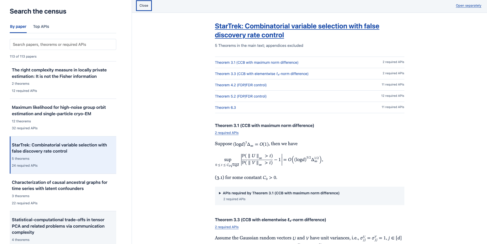
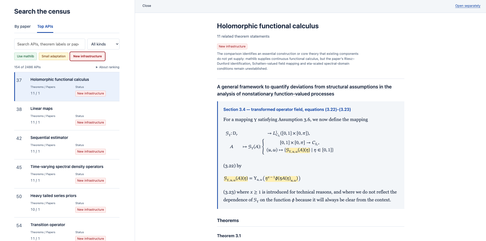

# How far are we to formalize Annals of statistics?

<a class="dashboard-cta" href="../../statistical-paper-census/experiments/aos-2024/report.html?view=apis">Explore the interactive dashboard</a>

I was trying to formalize some my own work recently and found definitions missing a lot. This motivated me to do a scan of Annals of Statistics (2024, 113 papers)to see how far are we even able to state the theorems in annals. 

To make the output stable, I built three reusable agent skills to help with this, and calibrated the skill over two  two papers:
[Gromov–Wasserstein distances: Entropic regularization, duality and sample complexity](https://arxiv.org/pdf/2212.12848v3)
and [Wasserstein convergence in Bayesian and frequentist deconvolution models](https://arxiv.org/pdf/2309.15300v1). The review involved checking statements, definitions, and check related mathlib declarations, and the HTML reader. Then I used the skill to scan all 113 papers, which covers **113 papers, 637 main-text Theorems and 2,486 grouped interfaces**. Lemmas in the main body are not being examined and appendix are negalected.

## What the ranking shows

The report has two filter: papers and APIs. I also highlighted the usage of the API back to the paper.

APIs are ranked by direct paper uses, then direct theorem uses. The
displayed **Theorems / Papers** counts also include indirect dependencies.

There are three labels:

- **Green — Use mathlib:** the interface can be expressed directly using mathlib
- **Yellow — Small adaptation:** math foundation exist, but a representation change or compatibility proof remains.
- **Red — New infrastructure:**  core result still needs to be developed.

Of the 2,486 audited entries, 21.8% are green (542), 72.0% are yellow (1,790), and 6.2% are red (154).

## What you can reuse

The [AoS-2024 repository](https://github.com/zixiaowang17/AoS-2024) includes the dashboard, audit records and three reusable skills:

- `statistical-paper-census` collects source statements and maps their dependencies.
- `ranked-mathlib-audit` searches a pinned mathlib revision and records matches and gaps.
- `statistical-census-html` turns those records into the searchable report.

## What still needs checking

I didn not finish checking every paper manually, this result is just serve as an initial scan for people who are also curious about the question - how far are we even to state the results in statistics.

I hope this helps people choose useful pieces of statistical infrastructure to work on.
Corrections and comments are welcome! 

## Next step

The year I chose is just the year of 2024, multiple years could be checked (need a lot token i suspect), I also plan to scan Biometrika /JASA /JRSS-B.
